# CI/CD Pipeline

Arbi's infrastructure uses **GitHub Actions** for continuous integration and deployment, enabling fully autonomous code deployment.

## Overview

Every project follows the same automated workflow:

```mermaid
graph LR
    A[Git Push] --> B[GitHub Actions]
    B --> C[Build Docker Image]
    C --> D[Run Tests]
    D --> E{Tests Pass?}
    E -->|Yes| F[Deploy to Server]
    E -->|No| G[Notify Failure]
    F --> H[Health Check]
    H --> I{Healthy?}
    I -->|Yes| J[Success ✅]
    I -->|No| K[Rollback]
```



## Workflow Structure

### 1. Build Stage

```yaml
- name: Build Docker image
  run: |
    docker build -t project-name:${{ github.sha }} .
    docker tag project-name:${{ github.sha }} project-name:latest
```

- Builds Docker image from Dockerfile
- Tags with git commit SHA for traceability
- Also tags as `latest` for deployment

### 2. Test Stage

```yaml
- name: Test container
  run: |
    docker run -d --name test-container -p 3000:3000 project-name:latest
    sleep 5
    curl -f http://localhost:3000/health || exit 1
    docker stop test-container
```

- Starts container temporarily
- Runs health checks
- Fails pipeline if tests don't pass

### 3. Deploy Stage

```yaml
- name: Deploy to server
  uses: appleboy/scp-action@v0.1.7
  with:
    host: ${{ secrets.SERVER_HOST }}
    username: ${{ secrets.SERVER_USER }}
    key: ${{ secrets.SSH_PRIVATE_KEY }}
    source: "image.tar.gz,docker-compose.prod.yml"
    target: "/tmp/deploy"
```

- Transfers built image to production server
- Uses SSH key authentication
- Copies docker-compose configuration

### 4. Deployment Execution

```yaml
- name: Deploy and restart container
  uses: appleboy/ssh-action@v1.0.3
  with:
    script: |
      docker load < /tmp/deploy/image.tar.gz
      cd /root/deployments/project-name
      docker compose down || true
      docker compose up -d
```

- Loads Docker image on server
- Stops old container
- Starts new container
- Zero downtime with health checks

## GitHub Secrets

Each repository requires these secrets:

| Secret | Description |
|--------|-------------|
| `SERVER_HOST` | Production server IP address |
| `SERVER_USER` | SSH username (usually `root`) |
| `SSH_PRIVATE_KEY` | SSH private key for authentication |

Set via:
```bash
gh secret set SERVER_HOST --body "173.255.225.53"
gh secret set SERVER_USER --body "root"
gh secret set SSH_PRIVATE_KEY < ~/.ssh/id_ed25519
```

## Deployment Targets

All services deploy to:
- **Server**: `173.255.225.53`
- **Deployment directory**: `/root/deployments/<project-name>/`
- **Docker network**: Bridge (default)

## Health Checks

Every container includes health checks:

```yaml
healthcheck:
  test: ["CMD", "wget", "--no-verbose", "--tries=1", "--spider", "http://localhost:3000/health"]
  interval: 30s
  timeout: 3s
  retries: 3
  start_period: 10s
```

This ensures:
- Container is responsive
- Application started correctly
- Automatic restarts on failure

## Rollback Strategy

If deployment fails:

1. Health check detects failure
2. Workflow exits with error
3. Previous container remains running
4. Manual intervention or auto-retry

For manual rollback:
```bash
cd /root/deployments/project-name
docker compose down
docker tag project-name:previous project-name:latest
docker compose up -d
```

## Best Practices

!!! tip "Deployment Tips"
    - Always test locally before pushing
    - Use descriptive commit messages
    - Monitor GitHub Actions logs
    - Check container health after deploy
    - Keep secrets rotated regularly

## Example Workflow

See the [wallet-dashboard workflow](https://github.com/Arbi-BFL/wallet-dashboard/blob/main/.github/workflows/deploy.yml) for a complete reference implementation.
